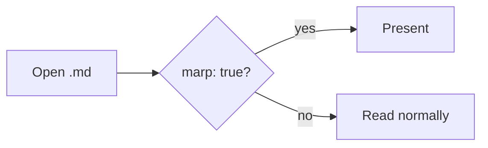

# MDHero Marp Demo

A **minimal Marp** presentation, rendered natively.

- `←` / `→` (or PageUp/Down, Space) to move
- `Home` / `End` to jump to first / last
- `Esc` to exit

---

## Why this slide won't split

The `---` below lives inside a code fence, so it must **not** start a new slide:

```yaml
marp: true
title: A deck
---
key: value
```

If splitting were regex-based, this slide would break in two. It shouldn't.

---

## Rich content works

Inline math renders: $E = mc^2$

A block equation:

$$
\int_{0}^{\infty} e^{-x^2}\,dx = \frac{\sqrt{\pi}}{2}
$$

1. Ordered lists
2. **Bold** and *italic*
3. `inline code`

---

## A diagram



Mermaid should render inside the slide.

---

## Last slide

> Themes, backgrounds, and headers are intentionally out of scope for v1.

That's the whole first cut — thanks for reviewing!
